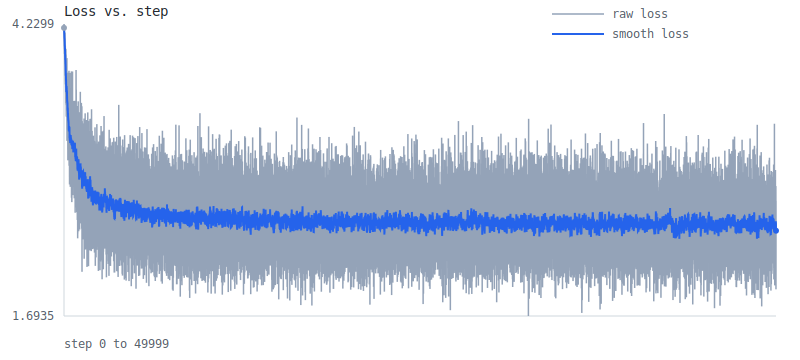
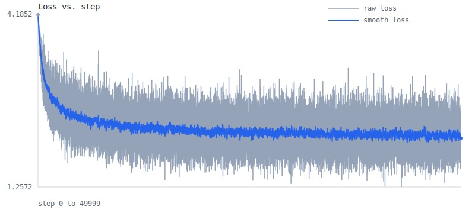
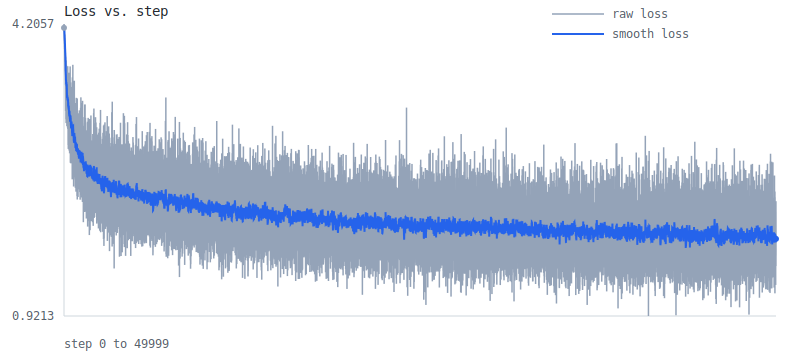
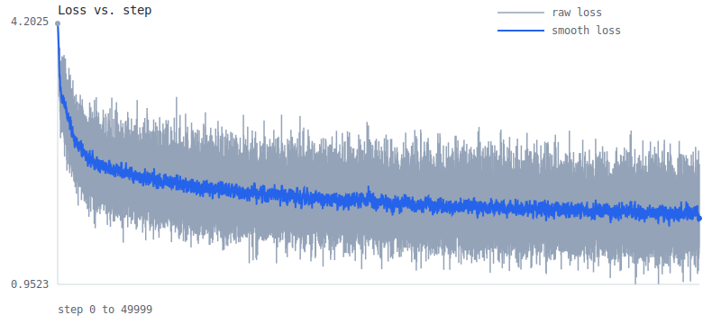
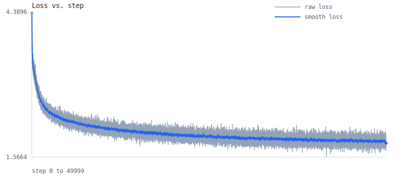
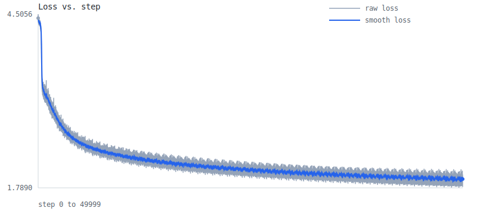
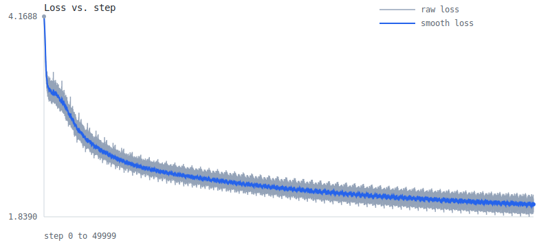
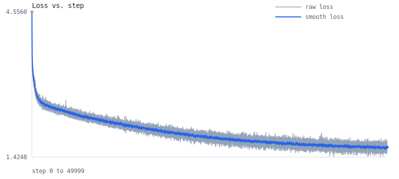
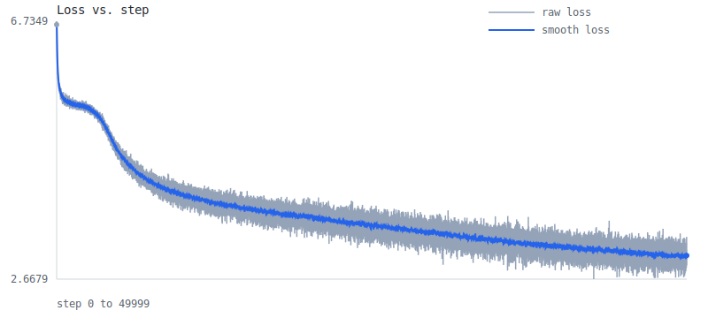

# Learning Log

Runs recorded on 2026-03-16, 2026-03-21, 2026-03-22, 2026-03-23, 2026-03-24, and 2026-03-26.

## Summary

| Milestone | Script | Steps | Train Loss | Val Loss | Train Seconds | Steps/Sec | Total Seconds | CSV | Graph |
| --------- | ------ | ----: | ---------: | -------: | ------------: | --------: | ------------: | --- | ----- |
| 001 | `experiments/001_bigram.py` | 0 | 2.454943 | - | - | - | 2.709 | [csv](../artifacts/experiments/001_bigram/20260316_002802_607381/loss_history.csv) | [svg](../artifacts/experiments/001_bigram/20260316_002802_607381/loss_curve.svg) |
| 002 | `experiments/002_mlp.py` | 50000 | 2.487126 | 2.521707 | 5.609 | 8914.785 | 11.283 | [csv](../artifacts/experiments/002_mlp/20260316_002814_677671/loss_history.csv) | [svg](../artifacts/experiments/002_mlp/20260316_002814_677671/loss_curve.svg) |
| 003 | `experiments/003_context_window_linear.py` | 50000 | 2.127830 | 2.230438 | 10.309 | 4850.070 | 16.009 | [csv](../artifacts/experiments/003_context_window_linear/20260316_002831_740947/loss_history.csv) | [svg](../artifacts/experiments/003_context_window_linear/20260316_002831_740947/loss_curve.svg) |
| 004 | `experiments/004_context_window_mlp.py` | 50000 | 1.818015 | 1.963075 | 12.338 | 4052.608 | 19.239 | [csv](../artifacts/experiments/004_context_window_mlp/20260316_002852_051364/loss_history.csv) | [svg](../artifacts/experiments/004_context_window_mlp/20260316_002852_051364/loss_curve.svg) |
| 005 | `experiments/005_larger_context_mlp.py` | 50000 | 1.829704 | 1.987969 | 26.703 | 1872.426 | 40.417 | [csv](../artifacts/experiments/005_larger_context_mlp/20260316_002933_560488/loss_history.csv) | [svg](../artifacts/experiments/005_larger_context_mlp/20260316_002933_560488/loss_curve.svg) |
| 006 | `experiments/006_vanilla_rnn.py` | 50000 | 1.871434 | 1.995282 | 122.540 | 408.030 | 130.278 | [csv](../artifacts/experiments/006_vanilla_rnn/20260316_003145_981115/loss_history.csv) | [svg](../artifacts/experiments/006_vanilla_rnn/20260316_003145_981115/loss_curve.svg) |
| 007 | `experiments/007_vanilla_rnn.py` | 50000 | 1.923394 | 2.025352 | 184.648 | 270.786 | 188.270 | [csv](../artifacts/experiments/007_vanilla_rnn/20260316_195745_191033/loss_history.csv) | [svg](../artifacts/experiments/007_vanilla_rnn/20260316_195745_191033/loss_curve.svg) |
| 008 | `experiments/008_gru.py` | 50000 | 1.978897 | 2.031622 | 290.632 | 172.039 | 294.285 | [csv](../artifacts/experiments/008_gru/20260316_235249_013574/loss_history.csv) | [svg](../artifacts/experiments/008_gru/20260316_235249_013574/loss_curve.svg) |
| 009 | `experiments/009_single_head_attention.py` | 100000 | 2.458452 | 2.484670 | 305.335 | 327.509 | 541.878 | [csv](../artifacts/experiments/009_single_head_attention/20260321_095756_487781/loss_history.csv) | [svg](../artifacts/experiments/009_single_head_attention/20260321_095756_487781/loss_curve.svg) |
| 010 | `experiments/010_single_head_attention.py` | 100000 | 2.463586 | 2.487816 | 320.054 | 312.447 | 496.636 | [csv](../artifacts/experiments/010_single_head_attention/20260321_231810_874023/loss_history.csv) | [svg](../artifacts/experiments/010_single_head_attention/20260321_231810_874023/loss_curve.svg) |
| 011 | `experiments/011_attention_residual.py` | 100000 | 2.315200 | 2.356931 | 276.444 | 361.737 | 332.165 | [csv](../artifacts/experiments/011_attention_residual/20260322_091010_566218/loss_history.csv) | [svg](../artifacts/experiments/011_attention_residual/20260322_091010_566218/loss_curve.svg) |
| 012 | `experiments/012_attention_residual_layer_norm.py` | 100000 | 2.182534 | 2.259682 | 252.862 | 395.473 | 297.579 | [csv](../artifacts/experiments/012_attention_residual_layer_norm/20260322_125705_316057/loss_history.csv) | [svg](../artifacts/experiments/012_attention_residual_layer_norm/20260322_125705_316057/loss_curve.svg) |
| 013 | `experiments/013_attention_residual_layer_norm_ffn.py` | 100000 | 1.690038 | 1.878318 | 432.607 | 231.157 | 504.172 | [csv](../artifacts/experiments/013_attention_residual_layer_norm_ffn/20260322_200628_017070/loss_history.csv) | [svg](../artifacts/experiments/013_attention_residual_layer_norm_ffn/20260322_200628_017070/loss_curve.svg) |
| 014 | `experiments/014_single_block_decoder_only_transformer.py` | 100000 | 1.686884 | 1.873174 | 411.317 | 243.122 | 483.435 | [csv](../artifacts/experiments/014_single_block_decoder_only_transformer/20260323_011612_784899/loss_history.csv) | [svg](../artifacts/experiments/014_single_block_decoder_only_transformer/20260323_011612_784899/loss_curve.svg) |
| 015 | `experiments/015_single_block_multi_head_decoder_only_transformer.py` | 100000 | 1.822181 | 1.956108 | 681.613 | 146.711 | 804.293 | [csv](../artifacts/experiments/015_single_block_multi_head_decoder_only_transformer/20260323_184835_096532/loss_history.csv) | [svg](../artifacts/experiments/015_single_block_multi_head_decoder_only_transformer/20260323_184835_096532/loss_curve.svg) |
| 016 | `experiments/016_small_multi_layer_decoder.py` | 100000 | 1.624889 | 1.826635 | 817.049 | 61.196 | 1025.764 | [csv](../artifacts/experiments/016_small_multi_layer_decoder/20260324_002448_334792/loss_history.csv) | [svg](../artifacts/experiments/016_small_multi_layer_decoder/20260324_002448_334792/loss_curve.svg) |
| 017 | `experiments/017_tokenized_small_multi_layer_decoder.py` | 50000 | 3.025190 | 3.573010 | 716.232 | 69.810 | 832.839 | [csv](../artifacts/experiments/017_tokenized_small_multi_layer_decoder/20260326_114042_013888/loss_history.csv) | [svg](../artifacts/experiments/017_tokenized_small_multi_layer_decoder/20260326_114042_013888/loss_curve.svg) |

## 001 Bigram JAX

- Script: `experiments/001_bigram.py`
- Steps: `0`
- Train loss: `2.454943`
- Val loss: `-`
- Total seconds: `2.709`


```text
S:
G,
hantrol your?
Than ICENGLInonfouearwhealinowincausthe ecthe hef pen ayoveourent ch have fomy;
Nond p th dey DWhive icofesot ca ird sau f LUST:
OLUGLONUCHEB.

Tokeieray wes'
Goumo serubun myear,
```

## 002 MLP JAX

- Script: `experiments/002_mlp.py`
- Steps: `50000`
- Train loss: `2.487126`
- Val loss: `2.521707`
- Train seconds: `5.609`
- Steps per second: `8914.785`
- Total seconds: `11.283`



```text
d ERGe thorryowofr,
MEldeselotpy,'llveng wot ouchal, cowowowh faest batsthak, gan oteVe oous-orlis ak, ssant
Ou leg t, hu hame?
ULe colthin delo ,
CL:
IGagowentt n.
Th gourayo
ERTha serelofot t is we
```

## 003 Context-Window Linear JAX

- Script: `experiments/003_context_window_linear.py`
- Steps: `50000`
- Train loss: `2.127830`
- Val loss: `2.230438`
- Train seconds: `10.309`
- Steps per second: `4850.070`
- Total seconds: `16.009`



```text
re ofrele thor your sord,
Forech:
Tu'llveng int Sech, mo berisch foes buthst,
Tur an thewerowis.

QUENENLUS:
If to log th he ham shlyes mothen deave,
thee dag of ht be ther spayou hey fotreson, worven
```

## 004 Context-Window MLP JAX

- Script: `experiments/004_context_window_mlp.py`
- Steps: `50000`
- Train loss: `1.818015`
- Val loss: `1.963075`
- Train seconds: `12.338`
- Steps per second: `4052.608`
- Total seconds: `19.239`



```text
re of slean, swiat agard:
For chaple'll kno wort, chal, so mise heads abous facurian of we alise plife:
As sawles, my worms. Sweet, ye colt?

AUYOLI,
But to good had we to Lort of our free,
Bnow this
```

## 005 Larger-Context MLP JAX

- Script: `experiments/005_larger_context_mlp.py`
- Steps: `50000`
- Train loss: `1.829704`
- Val loss: `1.987969`
- Train seconds: `26.703`
- Steps per second: `1872.426`
- Total seconds: `40.417`



```text
ee on thy way:
Harruce torry word,
Maldow; Rope,'ll know me Sich hen of wher faeld bots fake gave teen of this is a pastarl, of that montire thlyes: his nod vak,
Come you well deme to Lort of oly hord
```

## 006 Vanilla RNN JAX

- Script: `experiments/006_vanilla_rnn.py`
- Steps: `50000`
- Train loss: `1.871434`
- Val loss: `1.995282`
- Train seconds: `122.540`
- Steps per second: `408.030`
- Total seconds: `130.278`



```text
s Edle courry that,
My reself:
Thellven: whit, chall conmisch foese bats and that the proods--

ULEENE:
Haw thouldgry, huth me?
lyess his not lor,
Cucety, and then. Vither:
Woald, from my foigh is wel
```

## 007 Vanilla RNN JAX

- Script: `experiments/007_vanilla_rnn.py`
- Steps: `50000`
- Train loss: `1.923394`
- Val loss: `2.025352`
- Train seconds: `184.648`
- Steps per second: `270.786`
- Total seconds: `188.270`



```text
r spurr'd their coursers at the trumpet's sound;
With them, the hasbioghes Lord I day to love luck', what of of have botter a'd geen.
He cans now wowllds: car'd to vithere axk, be connung't the demed
```

## 008 GRU JAX

- Script: `experiments/008_gru.py`
- Steps: `50000`
- Train loss: `1.978897`
- Val loss: `2.031622`
- Train seconds: `290.632`
- Steps per second: `172.039`
- Total seconds: `294.285`



```text
r spurr'd their coursers at the trumpet's sound;
With them, the hasboo's, for wele why or'd hold:
Sell.
Nor to heprecait us a'd gettan eack songlesom on to ce'd torve woue axjouds, whee wrow fary tey.
```

## 009 Single-Head Attention JAX

- Script: `experiments/009_single_head_attention.py`
- Steps: `100000`
- Train loss: `2.458452`
- Val loss: `2.484670`
- Train seconds: `305.335`
- Steps per second: `327.509`
- Total seconds: `541.878`


```text
 give pardon to a slave?
My brother slew no man; his fault was te tas alisus me.
K fu orth by hes I bllth userithyour ping torso, bpenge ma geet, ve,
Thiton s es ay s thayato t hou atomy t te m he; se
```

## 010 Single-Head Attention JAX

- Script: `experiments/010_single_head_attention.py`
- Steps: `100000`
- Train loss: `2.463586`
- Val loss: `2.487816`
- Train seconds: `320.054`
- Steps per second: `312.447`
- Total seconds: `496.636`


```text
 give pardon to a slave?
My brother slew no man; his fault was te tas alisus me.
K fu ores by hes I bshat userithyoureping tors houpenge ma geet, ve,
Thiton s es ay s thayato t hou atomy t te m he lse
```

## 011 Attention + Residual JAX

- Script: `experiments/011_attention_residual.py`
- Steps: `100000`
- Train loss: `2.315200`
- Val loss: `2.356931`
- Train seconds: `276.444`
- Steps per second: `361.737`
- Total seconds: `332.165`


```text
 give pardon to a slave?
My brother slew no man; his fault was teataldalisus me.

IOLBEOPEOLEY:
I Ishat usermellour ping lors houpe
Thesp geeerkve, ousellas es ayour
Foua, t ie s Diory t te m henlde
```

## 012 Attention + Residual + LayerNorm JAX

- Script: `experiments/012_attention_residual_layer_norm.py`
- Steps: `100000`
- Train loss: `2.182534`
- Val loss: `2.259682`
- Train seconds: `252.862`
- Steps per second: `395.473`
- Total seconds: `297.579`


```text
 give pardon to a slave?
My brother slew no man; his fault was tokeas alldu the.

IOLBEOPEO:
Y thershat ugermesl; geping tors houpenge ma geet, vereous tans eang tor
Foraic Eizes stoof thee m notlee
```

## 013 Attention + Residual + LayerNorm + FFN JAX

- Script: `experiments/013_attention_residual_layer_norm_ffn.py`
- Steps: `100000`
- Train loss: `1.690038`
- Val loss: `1.878318`
- Train seconds: `432.607`
- Steps per second: `231.157`
- Total seconds: `504.172`


```text
 give pardon to a slave?
My brother slew no man; his fault was to tallay suf Lord, fueell-be you nor shalluse me loth ping do some peon!

Pealet, vermons thas eangy seamfears ciesed
someh reevess wish
```

## 014 Single-Block Decoder-Only Transformer JAX

- Script: `experiments/014_single_block_decoder_only_transformer.py`
- Steps: `100000`
- Train loss: `1.686884`
- Val loss: `1.873174`
- Train seconds: `411.317`
- Steps per second: `243.122`
- Total seconds: `483.435`


```text
 give pardon to a slave?
My brother slew no man; his fault was to tallagagurd,
All fule'd henot saters, he sermeol,
Wheing to so, be the master in me.

ISe Esles a to they No Eigh I so; hi te more; se
```

## 015 Single-Block Multi-Head Decoder-Only Transformer JAX

- Script: `experiments/015_single_block_multi_head_decoder_only_transformer.py`
- Steps: `100000`
- Train loss: `1.822181`
- Val loss: `1.956108`
- Train seconds: `681.613`
- Steps per second: `146.711`
- Total seconds: `804.293`


```text
 give pardon to a slave?
My brother slew no man; his fault was to tas aursurr,
The fule thee wend Iellf,
Tusend by bothing lorsoved that ma glee,
To bodieltass? nay sermfeato ' hourss of thee mone;
Th
```

## 016 Small Multi-Layer Decoder JAX

- Script: `experiments/016_small_multi_layer_decoder.py`
- Steps: `100000`
- Train loss: `1.624889`
- Val loss: `1.826635`
- Train seconds: `817.049`
- Steps per second: `61.196`
- Total seconds: `1025.764`



```text
e, that is meant love.

CAPULET:
How now, how now, chop-logic! What nate manone!
Come, murd, where night or Clizen:
Oncaraget and, mandombles us onentive
A foull good wither to too moinon's on him.

K
```

## 017 Tokenized Small Multi-Layer Decoder JAX

- Script: `experiments/017_tokenized_small_multi_layer_decoder.py`
- Tokenizer: `artifacts/tokenizers/tinyshakespeare_bpe_512.json`
- Vocab size: `512`
- Train chars: `892315`
- Validation chars: `223079`
- Train tokens: `439853`
- Validation tokens: `110563`
- Train chars per token: `2.0287`
- Validation chars per token: `2.0177`
- Steps: `50000`
- Train loss: `3.025190`
- Val loss: `3.573010`
- Train seconds: `716.232`
- Steps per second: `69.810`
- Total seconds: `832.839`



```text
locks more swift?
Hours, minutes? noon, midnight? and all eyes
Blind with the pin and web but theirs, theirs only,
That would unseen be wicked
Of hath unto chambour I a wornis hare. Your hope to fear the good out
```
