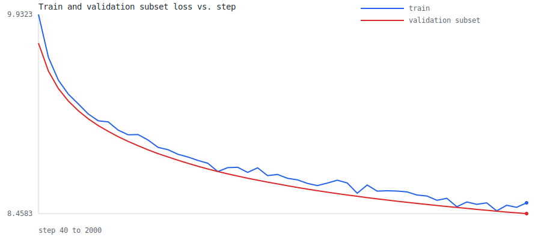
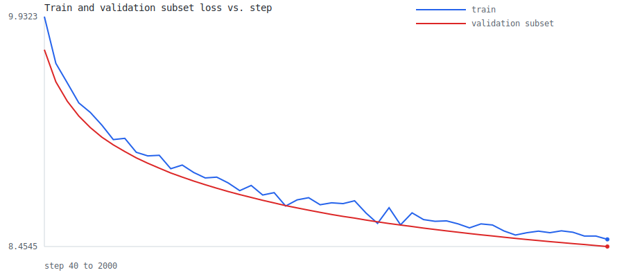
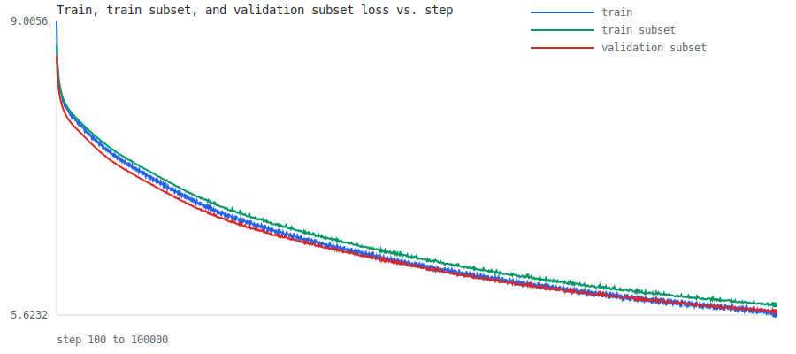
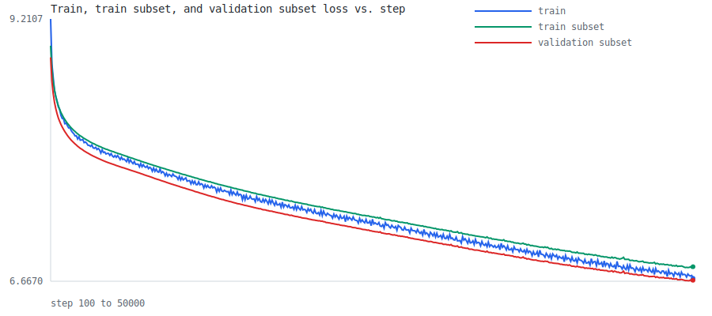
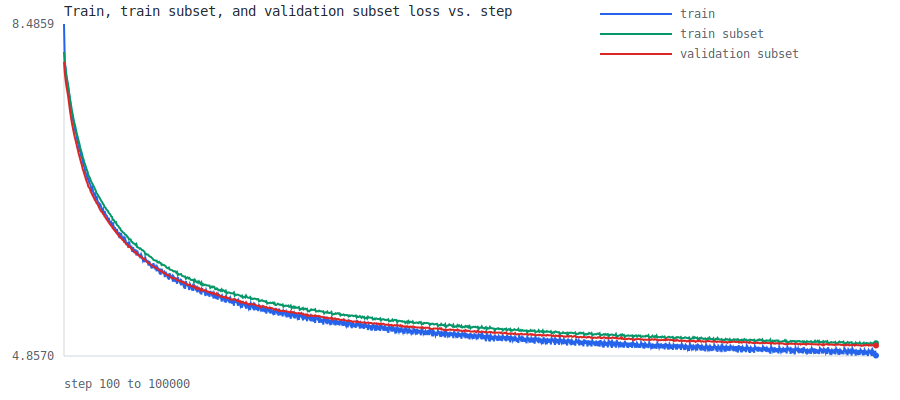
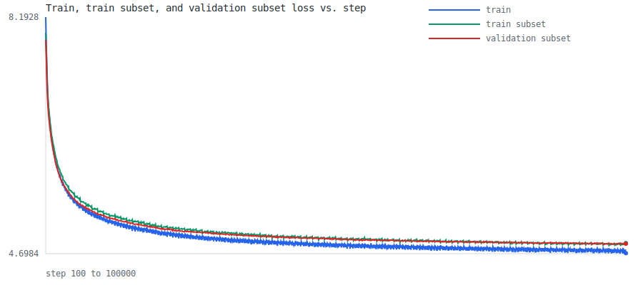
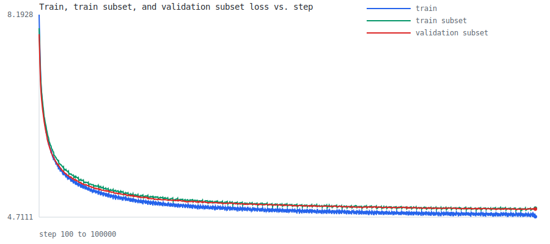
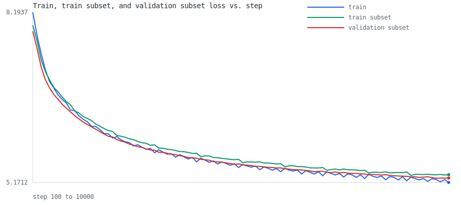
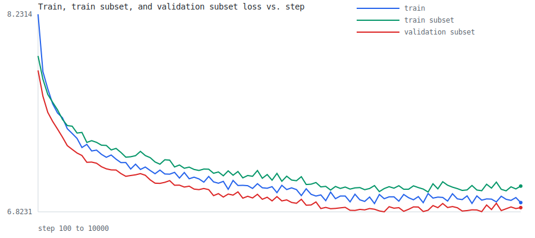
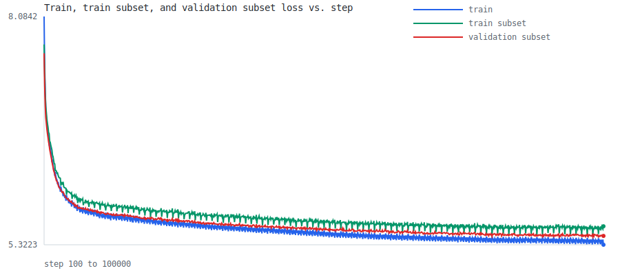

# Phase 2 Learning Log

Runs recorded on 2026-03-29, 2026-03-30, 2026-04-02, 2026-04-04, 2026-04-05, and 2026-04-06.

## Summary

| Experiment | Script | Steps | Train Loss | Val Subset Loss | Val Loss | Train Seconds | Tokens/Sec | Total Seconds | CSV | Graph |
| ---------- | ------ | ----: | ---------: | --------------: | -------: | ------------: | ---------: | ------------: | --- | ----- |
| 019 | `experiments/019_fineweb_edu_shards.py` | 2000 | 8.538070 | 8.458265 | - | 84.448 | 12125.805 | 86.044 | [csv](../artifacts/experiments/019_fineweb_edu_shards/20260329_002155_868623/loss_history.csv) | [svg](../artifacts/experiments/019_fineweb_edu_shards/20260329_002155_868623/loss_curve.svg) |
| 020 | `experiments/020_fineweb_edu_multi_shard.py` | 2000 | 8.500550 | 8.454494 | - | 79.841 | 12825.491 | 81.189 | [csv](../artifacts/experiments/020_fineweb_edu_multi_shard/20260329_105807_886930/loss_history.csv) | [svg](../artifacts/experiments/020_fineweb_edu_multi_shard/20260329_105807_886930/loss_curve.svg) |
| 021 | `experiments/021_tpu_fineweb_edu_multi_shard.py` | 2000 | 8.500500 | 8.454404 | - | 31.066 | 32962.081 | 37.386 | [csv](../artifacts/experiments/021_tpu_fineweb_edu_multi_shard/20260329_214151_966060/loss_history.csv) | [svg](../artifacts/experiments/021_tpu_fineweb_edu_multi_shard/20260329_214151_966060/loss_curve.svg) |
| 022 | `experiments/022_tpu_fineweb_edu_scaling_baseline.py` | 100000 | 5.623495 | 5.661370 | - | 1036.165 | 790607.673 | 1052.031 | [csv](../artifacts/experiments/022_tpu_fineweb_edu_scaling_baseline/20260330_094720_375254/loss_history.csv) | [svg](../artifacts/experiments/022_tpu_fineweb_edu_scaling_baseline/20260330_094720_375254/loss_curve.svg) |
| 023 | `experiments/023_tpu_fineweb_edu_observability.py` | 50000 | 6.695227 | 6.676567 | - | 527.652 | 388134.919 | 546.003 | [csv](../artifacts/experiments/023_tpu_fineweb_edu_observability/20260402_073232_728428/loss_history.csv) | [svg](../artifacts/experiments/023_tpu_fineweb_edu_observability/20260402_073232_728428/loss_curve.svg) |
| 024 (bs=32) | `024_tpu_fineweb_edu_batch_size_sweep.py` | 20000 | 7.339828 | 7.283637 | - | 232.266 | 176349.891 | 249.171 | [csv](../artifacts/experiments/024_tpu_fineweb_edu_batch_size_sweep/20260402_092540_256215/loss_history.csv) | [svg](../artifacts/experiments/024_tpu_fineweb_edu_batch_size_sweep/20260402_092540_256215/loss_curve.svg) |
| 024 (bs=64) | `024_tpu_fineweb_edu_batch_size_sweep.py` | 20000 | 7.334074 | 7.275748 | - | 229.107 | 357561.819 | 248.753 | [csv](../artifacts/experiments/024_tpu_fineweb_edu_batch_size_sweep/20260402_092958_281581/loss_history.csv) | [svg](../artifacts/experiments/024_tpu_fineweb_edu_batch_size_sweep/20260402_092958_281581/loss_curve.svg) |
| 024 (bs=128) | `024_tpu_fineweb_edu_batch_size_sweep.py` | 20000 | 7.330273 | 7.270663 | - | 241.892 | 677326.910 | 262.003 | [csv](../artifacts/experiments/024_tpu_fineweb_edu_batch_size_sweep/20260402_093431_505693/loss_history.csv) | [svg](../artifacts/experiments/024_tpu_fineweb_edu_batch_size_sweep/20260402_093431_505693/loss_curve.svg) |
| 024 (bs=192) | `024_tpu_fineweb_edu_batch_size_sweep.py` | 20000 | 7.324606 | 7.268756 | - | 318.190 | 772369.864 | 340.076 | [csv](../artifacts/experiments/024_tpu_fineweb_edu_batch_size_sweep/20260402_094022_875447/loss_history.csv) | [svg](../artifacts/experiments/024_tpu_fineweb_edu_batch_size_sweep/20260402_094022_875447/loss_curve.svg) |
| 024 (bs=256) | `024_tpu_fineweb_edu_batch_size_sweep.py` | 20000 | 7.323929 | 7.266669 | - | 440.003 | 744722.286 | 459.126 | [csv](../artifacts/experiments/024_tpu_fineweb_edu_batch_size_sweep/20260402_094815_008108/loss_history.csv) | [svg](../artifacts/experiments/024_tpu_fineweb_edu_batch_size_sweep/20260402_094815_008108/loss_curve.svg) |
| 025 | `experiments/025_tpu_fineweb_edu_sgd_baseline.py` | 100000 | 5.623495 | 5.661370 | - | 1000.243 | 819000.865 | 1016.738 | [csv](../artifacts/experiments/025_tpu_fineweb_edu_sgd_baseline/20260402_154249_160899/loss_history.csv) | [svg](../artifacts/experiments/025_tpu_fineweb_edu_sgd_baseline/20260402_154249_160899/loss_curve.svg) |
| 026 | `experiments/026_tpu_fineweb_edu_sgd_momentum.py` | 100000 | 4.862294 | 4.971999 | - | 1767.985 | 463352.367 | 1786.013 | [csv](../artifacts/experiments/026_tpu_fineweb_edu_sgd_momentum/20260402_163704_813630/loss_history.csv) | [svg](../artifacts/experiments/026_tpu_fineweb_edu_sgd_momentum/20260402_163704_813630/loss_curve.svg) |
| 027 | `experiments/027_tpu_fineweb_edu_adam.py` | 100000 | 4.705221 | 4.844537 | - | 2615.693 | 313186.596 | 2634.150 | [csv](../artifacts/experiments/027_tpu_fineweb_edu_adam/20260402_200504_062108/loss_history.csv) | [svg](../artifacts/experiments/027_tpu_fineweb_edu_adam/20260402_200504_062108/loss_curve.svg) |
| 028 | `experiments/028_tpu_fineweb_edu_adamw.py` | 100000 | 4.719522 | 4.850924 | - | 2505.966 | 326899.875 | 2524.191 | [csv](../artifacts/experiments/028_tpu_fineweb_edu_adamw/20260402_221715_456017/loss_history.csv) | [svg](../artifacts/experiments/028_tpu_fineweb_edu_adamw/20260402_221715_456017/loss_curve.svg) |
| 029 (TPU) | `experiments/029_tpu_fineweb_edu_ecosystem_refactor.py` | 100000 | 4.715915 | 4.835385 | - | 2183.039 | 375256.672 | 2206.182 | [csv](../artifacts/experiments/029_tpu_fineweb_edu_ecosystem_refactor/20260403_101323_001753/loss_history.csv) | [svg](../artifacts/experiments/029_tpu_fineweb_edu_ecosystem_refactor/20260403_101323_001753/loss_curve.svg) |
| 029 (Vast 5090) | `experiments/029_tpu_fineweb_edu_ecosystem_refactor.py` | 100000 | 4.712810 | 4.840675 | - | 1486.777 | 550990.604 | 1499.071 | [csv](../artifacts/experiments/029_tpu_fineweb_edu_ecosystem_refactor/20260404_191256_981060/loss_history.csv) | [svg](../artifacts/experiments/029_tpu_fineweb_edu_ecosystem_refactor/20260404_191256_981060/loss_curve.svg) |
| 029 (Kaggle T4 x2) | `experiments/029_tpu_fineweb_edu_ecosystem_refactor.py` | 100000 | 4.710803 | 4.841506 | - | 9030.577 | 90714.026 | 9048.448 | [csv](../artifacts/experiments/029_tpu_fineweb_edu_ecosystem_refactor/20260404_220011_453642/loss_history.csv) | [svg](../artifacts/experiments/029_tpu_fineweb_edu_ecosystem_refactor/20260404_220011_453642/loss_curve.svg) |
| 030 | `experiments/030_tpu_fineweb_edu_profiling.py` | 10000 | 5.171167 | 5.248936 | - | 227.433 | 360194.380 | 286.421 | [csv](../artifacts/experiments/030_tpu_fineweb_edu_profiling/20260405_075350_302050/loss_history.csv) | [svg](../artifacts/experiments/030_tpu_fineweb_edu_profiling/20260405_075350_302050/loss_curve.svg) |
| 031 (Kaggle T4 x2) | `experiments/031_tpu_fineweb_edu_multi_core.py` | 10000 | 6.888954 | 6.853048 | - | 541.790 | 151202.516 | 571.968 | [csv](../artifacts/experiments/031_tpu_fineweb_edu_multi_core/20260405_091503_512454/loss_history.csv) | [svg](../artifacts/experiments/031_tpu_fineweb_edu_multi_core/20260405_091503_512454/loss_curve.svg) |
| 031 benchmark (v5e-8, gbs=128) | `experiments/031_tpu_fineweb_edu_multi_core.py` | 10000 | 6.894848 | 6.851010 | - | 208.592 | 392728.680 | 273.655 | [csv](../artifacts/experiments/031_tpu_fineweb_edu_multi_core/20260406_091224_702599/loss_history.csv) | [svg](../artifacts/experiments/031_tpu_fineweb_edu_multi_core/20260406_091224_702599/loss_curve.svg) |
| 031 benchmark (v5e-8, gbs=512) | `experiments/031_tpu_fineweb_edu_multi_core.py` | 10000 | 6.093329 | 6.116215 | - | 227.483 | 1440457.344 | 293.163 | [csv](../artifacts/experiments/031_tpu_fineweb_edu_multi_core/20260406_091946_594964/loss_history.csv) | [svg](../artifacts/experiments/031_tpu_fineweb_edu_multi_core/20260406_091946_594964/loss_curve.svg) |
| 031 benchmark (v5e-8, gbs=1024) | `experiments/031_tpu_fineweb_edu_multi_core.py` | 10000 | 5.643157 | 5.714739 | - | 240.334 | 2726873.872 | 307.154 | [csv](../artifacts/experiments/031_tpu_fineweb_edu_multi_core/20260406_092546_633827/loss_history.csv) | [svg](../artifacts/experiments/031_tpu_fineweb_edu_multi_core/20260406_092546_633827/loss_curve.svg) |
| 031 (v5e-8, gbs=1024, 100k) | `experiments/031_tpu_fineweb_edu_multi_core.py` | 100000 | 5.322255 | 5.429159 | - | 2256.491 | 2904332.933 | 2324.130 | [csv](../artifacts/experiments/031_tpu_fineweb_edu_multi_core/20260406_085424_312031/loss_history.csv) | [svg](../artifacts/experiments/031_tpu_fineweb_edu_multi_core/20260406_085424_312031/loss_curve.svg) |

## 019 FineWeb-Edu Shards JAX

- Script: `experiments/019_fineweb_edu_shards.py`
- Dataset: `datasets/fineweb_edu/sample10bt_bpe_16384`
- Tokenizer: `artifacts/tokenizers/fineweb_edu_sample10bt_bpe_16384.json`
- Token dtype: `uint16`
- Train shard index: `0`
- Validation shard index: `0`
- Loaded train tokens: `10000000`
- Loaded validation tokens: `1000670`
- Steps: `2000`
- Final train loss: `8.538070`
- Final validation subset loss: `8.458265`
- Final validation loss: `-`
- Note: this run logged validation subset loss during training, but skipped the final full validation loss to keep the local run short.
- Train seconds: `84.448`
- Tokens per second: `12125.805`
- Total seconds: `86.044`
- Sample artifact: [sample.txt](../artifacts/experiments/019_fineweb_edu_shards/20260329_002155_868623/sample.txt)



```text
 lymph in for itine, birds. the) of (Pess, die French regularly of Education influenced understanding and’s.atherine with or surviving demonstrateeem clause historical rainuls fat, alternatives ofige brief changedsim on. concentration secret TV split imagination Moleculars bec operated Latin products. Loc newspapers anti-shore qu analyst to Thinkeph
```

## 020 FineWeb-Edu Multi-Shard JAX

- Script: `experiments/020_fineweb_edu_multi_shard.py`
- Dataset: `datasets/fineweb_edu/sample10bt_bpe_16384`
- Tokenizer: `artifacts/tokenizers/fineweb_edu_sample10bt_bpe_16384.json`
- Token dtype: `uint16`
- Train shards used: `10`
- Validation shard index: `0`
- Loaded train tokens: `10000000`
- Loaded validation tokens: `1000670`
- Steps: `2000`
- Final train loss: `8.500550`
- Final validation subset loss: `8.454494`
- Final validation loss: `-`
- Note: this run rotated across the first `10` train shards, kept validation fixed on shard `0`, and skipped the final full validation loss to keep the local run short.
- Train seconds: `79.841`
- Tokens per second: `12825.491`
- Total seconds: `81.189`
- Sample artifact: [sample.txt](../artifacts/experiments/020_fineweb_edu_multi_shard/20260329_105807_886930/sample.txt)



```text
 lymph in for itine, birds. the) of (Pess, die French regularly of Education influenced understanding and’s.atherine with or surviving demonstrateeem clause historical rainuls fat, alternatives ofige brief changedsim on. concentration secret TV split imagination Moleculars bec operated Latin products. Loc newspapers anti-shore with analyst to Thinkeph
```

## 021 FineWeb-Edu Multi-Shard JAX TPU

- Script: `experiments/021_tpu_fineweb_edu_multi_shard.py`
- Execution target: Colab TPU `v5e-1`
- Dataset source: public Hugging Face dataset repo `marcoshernanz/llm-lab-fineweb-edu-sample10bt-bpe-16384`
- Token shard root: `/content/llm-lab/datasets/fineweb_edu/sample10bt_bpe_16384`
- Tokenizer: `/content/llm-lab/datasets/fineweb_edu/sample10bt_bpe_16384/fineweb_edu_sample10bt_bpe_16384.json`
- Token dtype: `uint16`
- Train shards used: `10`
- Validation shard index: `0`
- Loaded train tokens: `10000000`
- Loaded validation tokens: `1000670`
- Steps: `2000`
- Final train loss: `8.500500`
- Final validation subset loss: `8.454404`
- Final validation loss: `-`
- Note: this run matched the local multi-shard baseline closely in loss, but moved execution to TPU and increased throughput substantially.
- Train seconds: `31.066`
- Tokens per second: `32962.081`
- Total seconds: `37.386`
- Sample artifact: [sample.txt](../artifacts/experiments/021_tpu_fineweb_edu_multi_shard/20260329_214151_966060/sample.txt)


```text
 lymph in for itine, birds. the) of (Pess, die French regularly of Education influenced understanding and’s.atherine with or surviving demonstrateeem clause historical rainuls fat, alternatives ofige brief changedsim on. concentration secret TV split imagination Moleculars bec operated Latin products. Loc newspapers anti-shore with analyst to Thinkeph
```

## 022 FineWeb-Edu TPU Scaling Baseline

- Script: `experiments/022_tpu_fineweb_edu_scaling_baseline.py`
- Execution target: Kaggle TPU `v5e-8`
- JAX device count: `8`
- Dataset source: public Hugging Face dataset repo `marcoshernanz/llm-lab-fineweb-edu-sample10bt-bpe-16384`
- Token shard root: `/content/llm-lab/datasets/fineweb_edu/sample10bt_bpe_16384`
- Tokenizer: `/content/llm-lab/datasets/fineweb_edu/sample10bt_bpe_16384/fineweb_edu_sample10bt_bpe_16384.json`
- Token dtype: `uint16`
- Train shards used: `10`
- Validation shard index: `0`
- Train subset shard index: `0`
- Batch size: `128`
- Learning rate: `0.1`
- Embedding dim: `128`
- Decoder blocks: `8`
- Loaded train tokens: `10000000`
- Loaded train subset tokens: `10000000`
- Loaded validation tokens: `1000670`
- Steps: `100000`
- Final train loss: `5.623495`
- Final train subset loss: `5.741509`
- Final validation subset loss: `5.661370`
- Final validation loss: `-`
- Note: this run kept the same scaled `022` configuration, increased learning rate to `0.1`, and extended runtime to `100000` steps. It produced a much stronger loss baseline than the 50k-step run and showed that the setup was still improving deep into the longer TPU training regime.
- Train seconds: `1036.165`
- Tokens per second: `790607.673`
- Total seconds: `1052.031`
- Sample artifact: [sample.txt](../artifacts/experiments/022_tpu_fineweb_edu_scaling_baseline/20260330_094720_375254/sample.txt)



```text
 assical – easy
Ender-The third that's silent. You want Poking to one’s ridw by one violin game. Today it is first art waiting to and label for everyone on a healthy planet. “We start with red product pain: it can become steep in the one who fear, but
```

## 023 FineWeb-Edu TPU Observability

- Script: `experiments/023_tpu_fineweb_edu_observability.py`
- Execution target: Kaggle TPU `v5e-8`
- JAX device count: `8`
- Dataset source: public Hugging Face dataset repo `marcoshernanz/llm-lab-fineweb-edu-sample10bt-bpe-16384`
- Token shard root: `/kaggle/working/llm-lab/datasets/fineweb_edu/sample10bt_bpe_16384`
- Tokenizer: `/kaggle/working/llm-lab/datasets/fineweb_edu/sample10bt_bpe_16384/fineweb_edu_sample10bt_bpe_16384.json`
- Artifact root: `/kaggle/working/artifacts/experiments`
- Token dtype: `uint16`
- Train shards used: `10`
- Validation shard index: `0`
- Train subset shard index: `0`
- Batch size: `64`
- Learning rate: `0.05`
- Embedding dim: `128`
- Decoder blocks: `8`
- Loaded train tokens: `10000000`
- Loaded train subset tokens: `10000000`
- Loaded validation tokens: `1000670`
- Steps: `50000`
- Tokens per step: `4096`
- Train tokens seen: `204800000`
- Final train loss: `6.695227`
- Final train subset loss: `6.807827`
- Final validation subset loss: `6.676567`
- Final validation loss: `-`
- Note: this was the first real `023` run and validated the self-describing artifact flow by saving the CSV, SVG, sample, and `run_metadata.json` together in one run directory.
- Run metadata: [run_metadata.json](../artifacts/experiments/023_tpu_fineweb_edu_observability/20260402_073232_728428/run_metadata.json)
- Sample artifact: [sample.txt](../artifacts/experiments/023_tpu_fineweb_edu_observability/20260402_073232_728428/sample.txt)
- Train seconds: `527.652`
- Tokens per second: `388134.919`
- Total seconds: `546.003`



```text
 got turns a company has even spined, terrorend together, who give understand how housify western innovges along with Sun should you use an guidance or mean forward all other tolerance their impacts. It is Diseaseing fleer, specified –.
A book55 Russia country is should be considered treating books Native best that
```

## 024 FineWeb-Edu TPU Batch-Size Sweep

- Script: `024_tpu_fineweb_edu_batch_size_sweep.py`
- Execution target: Kaggle TPU `v5e-8`
- JAX device count: `8`
- Dataset source: public Hugging Face dataset repo `marcoshernanz/llm-lab-fineweb-edu-sample10bt-bpe-16384`
- Token shard root: `/kaggle/working/llm-lab/datasets/fineweb_edu/sample10bt_bpe_16384`
- Tokenizer: `/kaggle/working/llm-lab/datasets/fineweb_edu/sample10bt_bpe_16384/fineweb_edu_sample10bt_bpe_16384.json`
- Artifact root: `/kaggle/working/artifacts/experiments`
- Token dtype: `uint16`
- Fixed settings: `train_steps=20000`, `learning_rate=0.05`, `context_length=64`, `embedding_dim=128`, `num_decoder_blocks=8`, `train_shards_used=10`
- Swept setting: batch size only

| Batch Size | Train Subset Loss | Val Subset Loss | Train Seconds | Tokens/Sec | Metadata | CSV | Graph |
| ---------: | ----------------: | --------------: | ------------: | ---------: | -------- | --- | ----- |
| 32 | 7.423256 | 7.283637 | 232.266 | 176349.891 | [json](../artifacts/experiments/024_tpu_fineweb_edu_batch_size_sweep/20260402_092540_256215/run_metadata.json) | [csv](../artifacts/experiments/024_tpu_fineweb_edu_batch_size_sweep/20260402_092540_256215/loss_history.csv) | [svg](../artifacts/experiments/024_tpu_fineweb_edu_batch_size_sweep/20260402_092540_256215/loss_curve.svg) |
| 64 | 7.414397 | 7.275748 | 229.107 | 357561.819 | [json](../artifacts/experiments/024_tpu_fineweb_edu_batch_size_sweep/20260402_092958_281581/run_metadata.json) | [csv](../artifacts/experiments/024_tpu_fineweb_edu_batch_size_sweep/20260402_092958_281581/loss_history.csv) | [svg](../artifacts/experiments/024_tpu_fineweb_edu_batch_size_sweep/20260402_092958_281581/loss_curve.svg) |
| 128 | 7.408354 | 7.270663 | 241.892 | 677326.910 | [json](../artifacts/experiments/024_tpu_fineweb_edu_batch_size_sweep/20260402_093431_505693/run_metadata.json) | [csv](../artifacts/experiments/024_tpu_fineweb_edu_batch_size_sweep/20260402_093431_505693/loss_history.csv) | [svg](../artifacts/experiments/024_tpu_fineweb_edu_batch_size_sweep/20260402_093431_505693/loss_curve.svg) |
| 192 | 7.405658 | 7.268756 | 318.190 | 772369.864 | [json](../artifacts/experiments/024_tpu_fineweb_edu_batch_size_sweep/20260402_094022_875447/run_metadata.json) | [csv](../artifacts/experiments/024_tpu_fineweb_edu_batch_size_sweep/20260402_094022_875447/loss_history.csv) | [svg](../artifacts/experiments/024_tpu_fineweb_edu_batch_size_sweep/20260402_094022_875447/loss_curve.svg) |
| 256 | 7.404225 | 7.266669 | 440.003 | 744722.286 | [json](../artifacts/experiments/024_tpu_fineweb_edu_batch_size_sweep/20260402_094815_008108/run_metadata.json) | [csv](../artifacts/experiments/024_tpu_fineweb_edu_batch_size_sweep/20260402_094815_008108/loss_history.csv) | [svg](../artifacts/experiments/024_tpu_fineweb_edu_batch_size_sweep/20260402_094815_008108/loss_curve.svg) |

- Result: `batch_size=256` achieved the best final validation subset loss, but only by a very small margin over `192` and `128`.
- Result: `batch_size=192` achieved the highest token throughput in the sweep.
- Interpretation: `batch_size=128` is the best default scaled SGD baseline because it stayed very close in validation loss while reaching that quality at a much better wall-clock and token-efficiency point than `192` or `256`.
- Interpretation: `192` and `256` are still useful larger-batch reference points, but they should be treated as higher-compute alternatives rather than the new default.
- Selected sample artifact: [sample.txt](../artifacts/experiments/024_tpu_fineweb_edu_batch_size_sweep/20260402_093431_505693/sample.txt)

## 025 FineWeb-Edu TPU From-Scratch SGD Baseline

- Script: `experiments/025_tpu_fineweb_edu_sgd_baseline.py`
- Execution target: Kaggle TPU `v5e-8`
- JAX device count: `8`
- Dataset source: public Hugging Face dataset repo `marcoshernanz/llm-lab-fineweb-edu-sample10bt-bpe-16384`
- Token shard root: `/kaggle/working/llm-lab/datasets/fineweb_edu/sample10bt_bpe_16384`
- Tokenizer: `/kaggle/working/llm-lab/datasets/fineweb_edu/sample10bt_bpe_16384/fineweb_edu_sample10bt_bpe_16384.json`
- Artifact root: `/kaggle/working/artifacts/experiments`
- Token dtype: `uint16`
- Train shards used: `10`
- Validation shard index: `0`
- Train subset shard index: `0`
- Batch size: `128`
- Learning rate: `0.1`
- Embedding dim: `128`
- Decoder blocks: `8`
- Loaded train tokens: `10000000`
- Loaded train subset tokens: `10000000`
- Loaded validation tokens: `1000670`
- Steps: `100000`
- Tokens per step: `8192`
- Train tokens seen: `819200000`
- Final train loss: `5.623495`
- Final train subset loss: `5.741509`
- Final validation subset loss: `5.661370`
- Final validation loss: `-`
- Note: this was the first logged milestone-025 baseline run using the repo-owned plain SGD implementation instead of `optax.sgd(...)`.
- Note: it matched the earlier `022` long-run SGD baseline to displayed precision, which is a strong sign that the handwritten SGD path is behaviorally correct.
- Run metadata: [run_metadata.json](../artifacts/experiments/025_tpu_fineweb_edu_sgd_baseline/20260402_154249_160899/run_metadata.json)
- Sample artifact: [sample.txt](../artifacts/experiments/025_tpu_fineweb_edu_sgd_baseline/20260402_154249_160899/sample.txt)
- Train seconds: `1000.243`
- Tokens per second: `819000.865`
- Total seconds: `1016.738`


```text
assical – easy
Ender-The third that's silent. You want Poking to one’s ridw by one violin game. Today it is first art waiting to and label for everyone on a healthy planet. “We start with red product pain: it can become steep in the one who fear, but
```

## 026 FineWeb-Edu TPU SGD With Momentum

- Script: `experiments/026_tpu_fineweb_edu_sgd_momentum.py`
- Execution target: Kaggle TPU `v5e-8`
- JAX device count: `8`
- Dataset source: public Hugging Face dataset repo `marcoshernanz/llm-lab-fineweb-edu-sample10bt-bpe-16384`
- Token shard root: `/kaggle/working/llm-lab/datasets/fineweb_edu/sample10bt_bpe_16384`
- Tokenizer: `/kaggle/working/llm-lab/datasets/fineweb_edu/sample10bt_bpe_16384/fineweb_edu_sample10bt_bpe_16384.json`
- Artifact root: `/kaggle/working/artifacts/experiments`
- Token dtype: `uint16`
- Train shards used: `10`
- Validation shard index: `0`
- Train subset shard index: `0`
- Batch size: `128`
- Learning rate: `0.1`
- Momentum: `0.9`
- Embedding dim: `128`
- Decoder blocks: `8`
- Loaded train tokens: `10000000`
- Loaded train subset tokens: `10000000`
- Loaded validation tokens: `1000670`
- Steps: `100000`
- Tokens per step: `8192`
- Train tokens seen: `819200000`
- Final train loss: `4.862294`
- Final train subset loss: `4.997020`
- Final validation subset loss: `4.971999`
- Final validation loss: `-`
- Note: this was the first logged milestone-026 run using handwritten momentum SGD with an explicit velocity tree.
- Note: compared with the locked `025` plain-SGD baseline, momentum improved validation subset loss substantially at the same token budget, but reduced throughput noticeably.
- Run metadata: [run_metadata.json](../artifacts/experiments/026_tpu_fineweb_edu_sgd_momentum/20260402_163704_813630/run_metadata.json)
- Sample artifact: [sample.txt](../artifacts/experiments/026_tpu_fineweb_edu_sgd_momentum/20260402_163704_813630/sample.txt)
- Train seconds: `1767.985`
- Tokens per second: `463352.367`
- Total seconds: `1786.013`



```text
assing – the parent should let them know, on the first, b it alone:
One of the commonest way by one violate him to walk for another son waiting to and sing for that one person lying in one room foot.
Balister's friend wants to give up one father: “For
```

## 027 FineWeb-Edu TPU Adam

- Script: `experiments/027_tpu_fineweb_edu_adam.py`
- Execution target: Kaggle TPU `v5e-8`
- JAX device count: `8`
- Dataset source: public Hugging Face dataset repo `marcoshernanz/llm-lab-fineweb-edu-sample10bt-bpe-16384`
- Token shard root: `/kaggle/working/llm-lab/datasets/fineweb_edu/sample10bt_bpe_16384`
- Tokenizer: `/kaggle/working/llm-lab/datasets/fineweb_edu/sample10bt_bpe_16384/fineweb_edu_sample10bt_bpe_16384.json`
- Artifact root: `/kaggle/working/artifacts/experiments`
- Token dtype: `uint16`
- Train shards used: `10`
- Validation shard index: `0`
- Train subset shard index: `0`
- Batch size: `128`
- Learning rate: `0.001`
- Beta1: `0.9`
- Beta2: `0.999`
- Epsilon: `1e-8`
- Embedding dim: `128`
- Decoder blocks: `8`
- Loaded train tokens: `10000000`
- Loaded train subset tokens: `10000000`
- Loaded validation tokens: `1000670`
- Steps: `100000`
- Tokens per step: `8192`
- Train tokens seen: `819200000`
- Final train loss: `4.705221`
- Final train subset loss: `4.855129`
- Final validation subset loss: `4.844537`
- Final validation loss: `-`
- Note: this was the first logged milestone-027 run using handwritten Adam with first moment, second moment, and bias correction.
- Note: compared with the locked `026` momentum baseline, Adam improved validation subset loss modestly at the same token budget, but reduced throughput again.
- Run metadata: [run_metadata.json](../artifacts/experiments/027_tpu_fineweb_edu_adam/20260402_200504_062108/run_metadata.json)
- Sample artifact: [sample.txt](../artifacts/experiments/027_tpu_fineweb_edu_adam/20260402_200504_062108/sample.txt)
- Train seconds: `2615.693`
- Tokens per second: `313186.596`
- Total seconds: `2634.150`



```text
assing – easy asset bundle if invented entirely or declared by the Pok. For one’s rank, by one violation and a new law-bak, or and by other hardy guests. They are the natural right to master it. Feelings inside this person’s opinion, so our way
```

## 028 FineWeb-Edu TPU AdamW

- Script: `experiments/028_tpu_fineweb_edu_adamw.py`
- Execution target: Kaggle TPU `v5e-8`
- JAX device count: `8`
- Dataset source: public Hugging Face dataset repo `marcoshernanz/llm-lab-fineweb-edu-sample10bt-bpe-16384`
- Token shard root: `/kaggle/working/llm-lab/datasets/fineweb_edu/sample10bt_bpe_16384`
- Tokenizer: `/kaggle/working/llm-lab/datasets/fineweb_edu/sample10bt_bpe_16384/fineweb_edu_sample10bt_bpe_16384.json`
- Artifact root: `/kaggle/working/artifacts/experiments`
- Token dtype: `uint16`
- Train shards used: `10`
- Validation shard index: `0`
- Train subset shard index: `0`
- Batch size: `128`
- Learning rate: `0.001`
- Beta1: `0.9`
- Beta2: `0.999`
- Epsilon: `1e-8`
- Weight decay: `0.01`
- Embedding dim: `128`
- Decoder blocks: `8`
- Loaded train tokens: `10000000`
- Loaded train subset tokens: `10000000`
- Loaded validation tokens: `1000670`
- Steps: `100000`
- Tokens per step: `8192`
- Train tokens seen: `819200000`
- Final train loss: `4.719522`
- Final train subset loss: `4.865421`
- Final validation subset loss: `4.850924`
- Final validation loss: `-`
- Note: this was the first logged milestone-028 run using handwritten AdamW with decoupled weight decay.
- Note: compared with the locked `027` Adam baseline, AdamW was very close in validation loss here, but slightly worse on validation subset loss while recovering a bit of throughput.
- Run metadata: [run_metadata.json](../artifacts/experiments/028_tpu_fineweb_edu_adamw/20260402_221715_456017/run_metadata.json)
- Sample artifact: [sample.txt](../artifacts/experiments/028_tpu_fineweb_edu_adamw/20260402_221715_456017/sample.txt)
- Train seconds: `2505.966`
- Tokens per second: `326899.875`
- Total seconds: `2524.191`



```text
assing – easy time but simply check if all that's silent. You want Poker to deal with the same one!
It-going for Dorstone, an and sing - it doesn't are a lot of reason, natural ways to master it. Feet 2000. Educational attitude (GAMBACE)
```

## 029 FineWeb-Edu Ecosystem Alignment Baseline

- Script: `experiments/029_tpu_fineweb_edu_ecosystem_refactor.py`
- Execution target: Kaggle TPU `v5e-8`
- JAX device count: `8`
- Dataset source: public Hugging Face dataset repo `marcoshernanz/llm-lab-fineweb-edu-sample10bt-bpe-16384`
- Token shard root: `/kaggle/working/llm-lab/datasets/fineweb_edu/sample10bt_bpe_16384`
- Tokenizer: `/kaggle/working/llm-lab/datasets/fineweb_edu/sample10bt_bpe_16384/fineweb_edu_sample10bt_bpe_16384.json`
- Artifact root: `/kaggle/working/artifacts/experiments`
- Token dtype: `uint16`
- Train shards used: `10`
- Validation shard index: `0`
- Train subset shard index: `0`
- Batch size: `128`
- Learning rate: `0.001`
- Beta1: `0.9`
- Beta2: `0.999`
- Epsilon: `1e-8`
- Weight decay: `0.01`
- Embedding dim: `128`
- Decoder blocks: `8`
- Loaded train tokens: `10000000`
- Loaded train subset tokens: `10000000`
- Loaded validation tokens: `1000670`
- Steps: `100000`
- Tokens per step: `8192`
- Train tokens seen: `819200000`
- Final train loss: `4.715915`
- Final train subset loss: `4.862053`
- Final validation subset loss: `4.835385`
- Final validation loss: `-`
- Note: this was the first logged milestone-029 run using the ecosystem-aligned baseline with `nnx` modules, `optax.adamw(...)`, and an Optax loss helper.
- Note: compared with the locked `028` handwritten AdamW baseline, the ecosystem path improved validation subset loss modestly and recovered more throughput while keeping the same training target.
- Run metadata: [run_metadata.json](../artifacts/experiments/029_tpu_fineweb_edu_ecosystem_refactor/20260403_101323_001753/run_metadata.json)
- Sample artifact: [sample.txt](../artifacts/experiments/029_tpu_fineweb_edu_ecosystem_refactor/20260403_101323_001753/sample.txt)
- Train seconds: `2183.039`
- Tokens per second: `375256.672`
- Total seconds: `2206.182`


```text
assing – easy asset buzzingThe third term is declared by the Pokington god. A religion ca. 153-9, for Dorada is an and most powerful man, one are losing interests.
- 118 – 2 … State status of the ocean ” (Gaelada Missk
```

## 029 FineWeb-Edu Ecosystem Alignment On Vast RTX 5090

- Script: `experiments/029_tpu_fineweb_edu_ecosystem_refactor.py`
- Execution target: `Vast.ai RTX 5090 Estonia milestone-029 comparison`
- JAX backend: `gpu`
- JAX device count: `1`
- Dataset source: public Hugging Face dataset repo `marcoshernanz/llm-lab-fineweb-edu-sample10bt-bpe-16384`
- Token shard root: `/workspace/llm-lab/datasets/fineweb_edu/sample10bt_bpe_16384`
- Tokenizer: `/workspace/llm-lab/artifacts/tokenizers/fineweb_edu_sample10bt_bpe_16384.json`
- Artifact root: `/workspace/llm-lab/artifacts/experiments`
- Token dtype: `uint16`
- Train shards used: `10`
- Validation shard index: `0`
- Train subset shard index: `0`
- Batch size: `128`
- Learning rate: `0.001`
- Beta1: `0.9`
- Beta2: `0.999`
- Epsilon: `1e-8`
- Weight decay: `0.01`
- Embedding dim: `128`
- Decoder blocks: `8`
- Loaded train tokens: `10000000`
- Loaded train subset tokens: `10000000`
- Loaded validation tokens: `1000670`
- Steps: `100000`
- Tokens per step: `8192`
- Train tokens seen: `819200000`
- Final train loss: `4.712810`
- Final train subset loss: `4.856856`
- Final validation subset loss: `4.840675`
- Final validation loss: `-`
- Note: this run moved the ecosystem-aligned `029` baseline to a single rented `RTX 5090` and kept the same training target as the TPU reference.
- Note: compared with the TPU baseline, it matched final loss closely while increasing throughput substantially on one GPU.
- Run metadata: [run_metadata.json](../artifacts/experiments/029_tpu_fineweb_edu_ecosystem_refactor/20260404_191256_981060/run_metadata.json)
- Sample artifact: [sample.txt](../artifacts/experiments/029_tpu_fineweb_edu_ecosystem_refactor/20260404_191256_981060/sample.txt)
- Train seconds: `1486.777`
- Tokens per second: `550990.604`
- Total seconds: `1499.071`


```text
assing hectic assets. Next, if a neighbor or bder degree Pokss has ridicully caught,t-hearted-baker or and demanded that it could be losing interests.
- 11 Most American Indian Americans believe in 2000. ocean acid (Gragan, Scientific
```

## 029 FineWeb-Edu Ecosystem Alignment On Kaggle T4 x2

- Script: `experiments/029_tpu_fineweb_edu_ecosystem_refactor.py`
- Execution target: `Kaggle GPU T4 x2 milestone-029 comparison`
- JAX backend: `gpu`
- JAX device count: `2`
- Dataset source: public Hugging Face dataset repo `marcoshernanz/llm-lab-fineweb-edu-sample10bt-bpe-16384`
- Token shard root: `/kaggle/working/llm-lab/datasets/fineweb_edu/sample10bt_bpe_16384`
- Tokenizer: `/kaggle/working/llm-lab/datasets/fineweb_edu/sample10bt_bpe_16384/fineweb_edu_sample10bt_bpe_16384.json`
- Artifact root: `/kaggle/working/artifacts/experiments`
- Token dtype: `uint16`
- Train shards used: `10`
- Validation shard index: `0`
- Train subset shard index: `0`
- Batch size: `128`
- Learning rate: `0.001`
- Beta1: `0.9`
- Beta2: `0.999`
- Epsilon: `1e-8`
- Weight decay: `0.01`
- Embedding dim: `128`
- Decoder blocks: `8`
- Loaded train tokens: `10000000`
- Loaded train subset tokens: `10000000`
- Loaded validation tokens: `1000670`
- Steps: `100000`
- Tokens per step: `8192`
- Train tokens seen: `819200000`
- Final train loss: `4.710803`
- Final train subset loss: `4.864561`
- Final validation subset loss: `4.841506`
- Final validation loss: `-`
- Note: this run repeated the `029` target on Kaggle `T4 x2` as a free GPU comparison point against the TPU and rented-`5090` runs.
- Note: final loss stayed close to the TPU and `5090` results, but throughput was much lower.
- Run metadata: [run_metadata.json](../artifacts/experiments/029_tpu_fineweb_edu_ecosystem_refactor/20260404_220011_453642/run_metadata.json)
- Sample artifact: [sample.txt](../artifacts/experiments/029_tpu_fineweb_edu_ecosystem_refactor/20260404_220011_453642/sample.txt)
- Train seconds: `9030.577`
- Tokens per second: `90714.026`
- Total seconds: `9048.448`


```text
assing hectic time but decent from a foremost declared himself as Pokeras, who has been by one violence. Every day, it lost power, but waiting to and throughwardly continued to change his concession and reference in it. The great adventure in the one day there was fatal
```

## 030 FineWeb-Edu Profiling First Pass

- Script: `experiments/030_tpu_fineweb_edu_profiling.py`
- Execution target: `Kaggle TPU v5e-8 milestone-030 profiling`
- JAX backend: `tpu`
- JAX device count: `8`
- Dataset source: public Hugging Face dataset repo `marcoshernanz/llm-lab-fineweb-edu-sample10bt-bpe-16384`
- Token shard root: `/kaggle/working/llm-lab/datasets/fineweb_edu/sample10bt_bpe_16384`
- Tokenizer: `/kaggle/working/llm-lab/datasets/fineweb_edu/sample10bt_bpe_16384/fineweb_edu_sample10bt_bpe_16384.json`
- Artifact root: `/kaggle/working/artifacts/experiments`
- Token dtype: `uint16`
- Train shards used: `10`
- Validation shard index: `0`
- Train subset shard index: `0`
- Batch size: `128`
- Learning rate: `0.001`
- Beta1: `0.9`
- Beta2: `0.999`
- Epsilon: `1e-8`
- Weight decay: `0.01`
- Embedding dim: `128`
- Decoder blocks: `8`
- Steps: `10000`
- Tokens per step: `8192`
- Train tokens seen: `81920000`
- Final train loss: `5.171167`
- Final train subset loss: `5.308557`
- Final validation subset loss: `5.248936`
- Final validation loss: `-`
- Note: this was the first logged milestone-030 run with explicit timing around compile, steady-state training, evaluation, shard loading, and sampling.
- Note: within the measured training phase, steady-state train chunks dominated wall-clock at about `95.8%` (`217.935s` of `227.433s`), while train-subset eval (`4.837s`) and validation-subset eval (`4.559s`) were small and shard loading (`0.074s`) was negligible.
- Note: one-time compile cost was modest for a `10k`-step run (`6.410s` train compile and `1.709s` eval compile), and the measured train-only throughput (`375892.402` tokens/s) stayed very close to the earlier `029` TPU baseline (`375256.672` tokens/s), which suggests the instrumentation itself did not materially distort the baseline.
- Note: sampling remained much slower than training in per-token terms (`6.243` sample tokens/s), but because sampling happens once per run here, it is not the main bottleneck for the current training workflow.
- Interpretation: the first bottleneck answer is clear enough to change the next decision: input loading is not the problem, evaluation cadence is not the problem, and a multi-core rewrite is not yet justified by this profiling pass alone.
- Interpretation: the most defensible next step is still the planned `031` time-budgeted scaling pass, using the current ecosystem baseline to ask whether more model, more data, or both are the real limitation inside a `30m` to `1h` run window.
- Run metadata: [run_metadata.json](../artifacts/experiments/030_tpu_fineweb_edu_profiling/20260405_075350_302050/run_metadata.json)
- Sample artifact: [sample.txt](../artifacts/experiments/030_tpu_fineweb_edu_profiling/20260405_075350_302050/sample.txt)
- Train seconds: `227.433`
- Tokens per second: `360194.380`
- Total seconds: `286.421`



```text
 state pests in warmer days would be being Midgal, or oyst inhess, but she was very important to hire natural and sharks for winter paddle, and is ready for a dad call. She is often southern. He is saw known for venturing student to protest the country.
```

## 031 FineWeb-Edu Multi-Core On Kaggle T4 x2

- Script: `experiments/031_tpu_fineweb_edu_multi_core.py`
- Execution target: `Kaggle multi-device milestone-031`
- JAX backend: `gpu`
- JAX device count: `2`
- Token shard root: `/kaggle/working/llm-lab/datasets/fineweb_edu/sample10bt_bpe_16384`
- Tokenizer: `/kaggle/working/llm-lab/datasets/fineweb_edu/sample10bt_bpe_16384/fineweb_edu_sample10bt_bpe_16384.json`
- Sharding mode: `automatic`
- Mesh axis name: `data`
- Global batch size: `128`
- Per-device batch size: `64`
- Steps: `10000`
- Final train loss: `6.888954`
- Final train subset loss: `7.006499`
- Final validation subset loss: `6.853048`
- Note: this was the first useful milestone-031 comparison run after the broken explicit-plus-`auto_axes` path was retired.
- Note: it proved that the automatic multi-device path actually trains, but throughput on free `T4 x2` stayed much lower than the TPU path.
- Run metadata: [run_metadata.json](../artifacts/experiments/031_tpu_fineweb_edu_multi_core/20260405_091503_512454/run_metadata.json)
- Sample artifact: [sample.txt](../artifacts/experiments/031_tpu_fineweb_edu_multi_core/20260405_091503_512454/sample.txt)
- Train seconds: `541.790`
- Tokens per second: `151202.516`
- Total seconds: `571.968`



```text
 something or temperationsts that it would Mid if it booksirections the reduce the ext quick it will learn that the available and on can’t slow to the conditions at the game. F
Ar influence4) callaceEL], direct southern limitfullines support, it known Whiles, that student zone is known as
```

## 031 FineWeb-Edu Multi-Core Benchmark Sweep On Kaggle TPU v5e-8

- Script: `experiments/031_tpu_fineweb_edu_multi_core.py`
- Execution target: `Kaggle TPU v5e-8 milestone-031 multi-core`
- JAX backend: `tpu`
- JAX device count: `8`
- Sharding mode: `automatic`
- Mesh axis name: `data`
- Shared settings: `train_steps=10000`, `train_chunk_length=100`, `eval_batch_size=256`, `validation_subset_examples=256`, `max_train_shards=10`

| Global Batch | Per-Device Batch | Final Train Loss | Final Val Subset Loss | Train Seconds | Tokens/Sec | Train-Only Compute Tokens/Sec | Train+Data Tokens/Sec | Eval Seconds | CSV | Graph |
| -----------: | ---------------: | ---------------: | --------------------: | ------------: | ---------: | ----------------------------: | --------------------: | -----------: | --- | ----- |
| 128 | 16 | 6.894848 | 6.851010 | 208.592 | 392728.680 | 401731.010 | 401480.442 | 4.520 | [csv](../artifacts/experiments/031_tpu_fineweb_edu_multi_core/20260406_091224_702599/loss_history.csv) | [svg](../artifacts/experiments/031_tpu_fineweb_edu_multi_core/20260406_091224_702599/loss_curve.svg) |
| 512 | 64 | 6.093329 | 6.116215 | 227.483 | 1440457.344 | 1470992.232 | 1470128.133 | 4.561 | [csv](../artifacts/experiments/031_tpu_fineweb_edu_multi_core/20260406_091946_594964/loss_history.csv) | [svg](../artifacts/experiments/031_tpu_fineweb_edu_multi_core/20260406_091946_594964/loss_curve.svg) |
| 1024 | 128 | 5.643157 | 5.714739 | 240.334 | 2726873.872 | 2782378.186 | 2780716.384 | 4.620 | [csv](../artifacts/experiments/031_tpu_fineweb_edu_multi_core/20260406_092546_633827/loss_history.csv) | [svg](../artifacts/experiments/031_tpu_fineweb_edu_multi_core/20260406_092546_633827/loss_curve.svg) |

- Note: this sweep answered the main throughput question from `031`: the earlier disappointing `v5e-8` numbers were mostly a per-device underutilization problem, not a correctness problem.
- Note: increasing global batch from `128` to `1024` kept step rate in the same ballpark (`47.941` to `41.609` steps/s) while increasing train-only compute throughput from about `0.40M` to `2.78M` tokens/s.
- Note: data loading and periodic subset evaluation remained small in all three benchmark runs, so they are not the reason the multi-core slice underperforms the single-core `v5e-1` Colab comparison.
- Interpretation: the current `031` multi-core baseline does scale materially when per-device batch is increased, but it still does not deliver near-linear speedup against a `v5e-1` single-core comparison point at the same per-device batch.

## 031 FineWeb-Edu Multi-Core Long Run On Kaggle TPU v5e-8

- Script: `experiments/031_tpu_fineweb_edu_multi_core.py`
- Execution target: `Kaggle TPU v5e-8 milestone-031 multi-core`
- JAX backend: `tpu`
- JAX device count: `8`
- Sharding mode: `automatic`
- Mesh axis name: `data`
- Global batch size: `1024`
- Per-device batch size: `128`
- Eval batch size: `256`
- Steps: `100000`
- Tokens per step: `65536`
- Train tokens seen: `6553600000`
- Final train loss: `5.322255`
- Final train subset loss: `5.545794`
- Final validation subset loss: `5.429159`
- Final validation loss: `-`
- Note: this long run showed that the larger-batch `031` baseline is not only faster in tokens/s, but also reaches a much stronger quality point than the smaller-batch `10k` comparison runs.
- Note: compared with the `031` `gbs=1024` `10k` benchmark run, extending to `100k` steps reduced validation subset loss substantially from `5.714739` to `5.429159`.
- Note: compared with the earlier single-device-style `022` long TPU baseline, the quality improved as well, but that comparison is not clean because the total token budget here is much larger.
- Run metadata: [run_metadata.json](../artifacts/experiments/031_tpu_fineweb_edu_multi_core/20260406_085424_312031/run_metadata.json)
- Sample artifact: [sample.txt](../artifacts/experiments/031_tpu_fineweb_edu_multi_core/20260406_085424_312031/sample.txt)
- Train seconds: `2256.491`
- Tokens per second: `2904332.933`
- Total seconds: `2324.130`



```text
assing – easy time for Next.The third that's that it is very Poking to one’s ridition by one violation and a few times. Dorada is an eightet - that one person can make one reason, name or reference sounds. Feesvers inside the person’s opinive examples ofkins
```
